# Установка VS Code

## Windows

1. Загрузите дитрибутив для windows с [сайта](https://code.visualstudio.com/download)

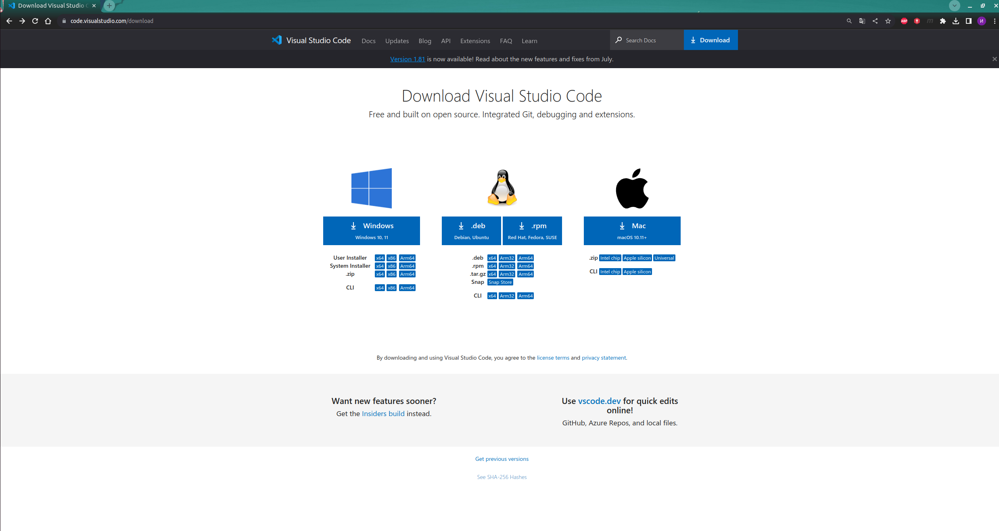

2. Запустите скачанный файл и следуйте инструкциям

## Ubuntu

1. Загрузить дистрибутив `*.deb` с [сайта](https://code.visualstudio.com/download)


2. Наберите в терминале команду `sudo apt install *.deb`

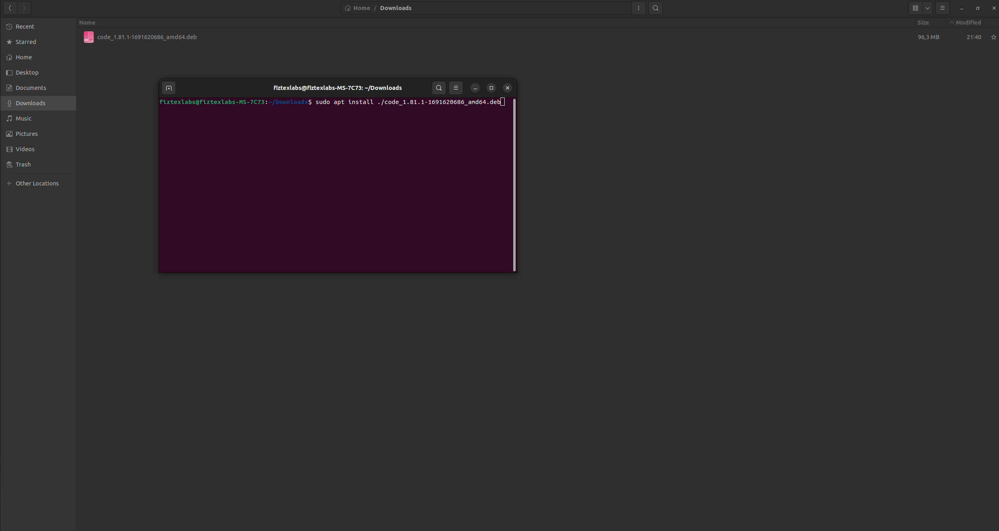

# Установка CMake в систему

Платформа **CMake** предназначена для сборки кросплатформенных приложений на языках *C*, *C++*, *Python* и некоторых других.

## Windows

Скачайте с официального [сайта](https://cmake.org/download/) дистрибутив `*.msi`, откройте скачанный файл и следуйте иснтрукциям по установке 

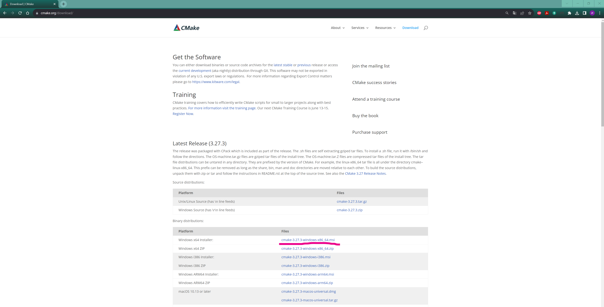

## Ubuntu

В терминале наберите команду `sudo apt install cmake`

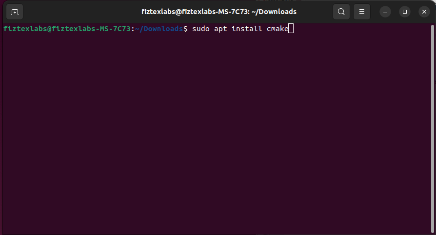


# Настройка VS Code

*Настрока **VS Code** не отличается для различных ОС

## Инструменты C/C++

Это очень полезные расширения, которые добавят в **VS Code** поддержку синтаксиса C/C++, а также функционал **IntelliSense** - интелектуального помошника для написания и анализа кода. Для его установки:

1. На панели слева перейти во вкладку Extensions

2. В строке поиска набрать C++

3. Установить расширения **C/C++**, **C/C++ Extension Pack**, **C/C++ Themes**

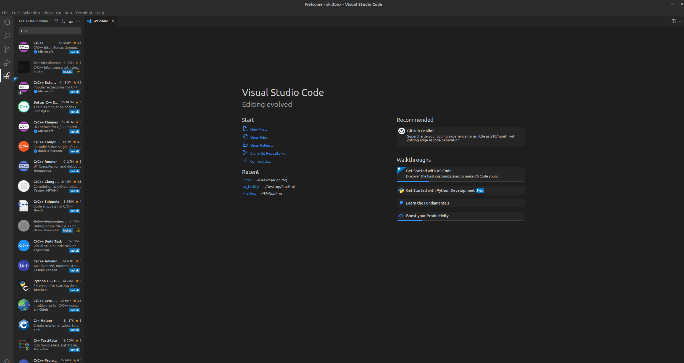

## Инструменты CMake

Процесс установки инструментов **CMake**, которые добавят поддержку синтаксиса **CMake** в **VS Code** точно такой же, как и для инструментов **C/C++**: расширения **CMake** и **CMake Tools** на вкладке *Extensions*

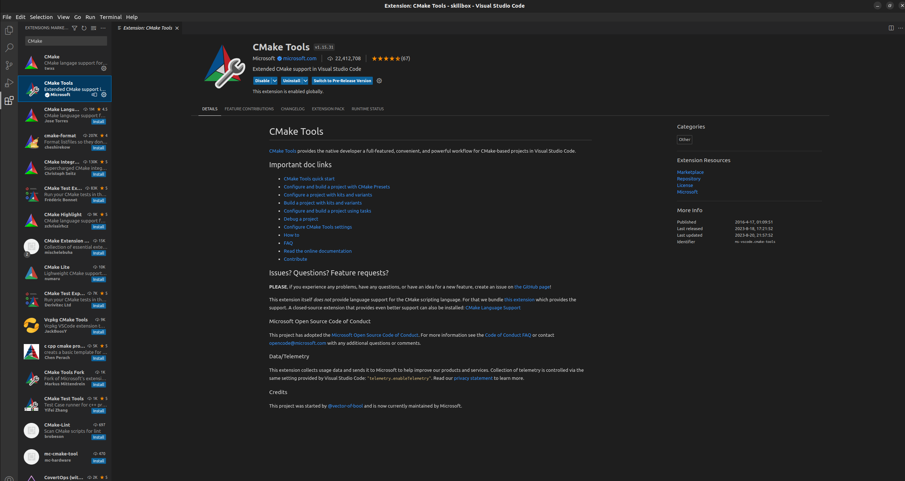

## PlatformIO

**PlatformIO** - это настоящая экосистема для разработки программ для микроконтроллеров. В настоящее время она поддерживает огромное количество плат и микроконтроллеров, с полным списком которых вы можете познакомиться на [официальном сайте](https://docs.platformio.org/en/latest/boards/index.html). В отличие от распространенной **ArduinoIDE**, **PlatformIO** выгодно отличается:
 - наличием отладчика
 - наличием интеграции с ситемой контроля версий **Git**
 - возможностью использования **IntelliSense** и прочих плагинов
 - удобством создания многофайловых систем
 - возможностью кастомизации (настройки расзличных цветовых тем)
 
**PlatformIO** может использоваться как в виде самостоятельной среды разработки, так и в качестве расширения для VS Code: процесс установки точно такой же, как для инструментов C/C++ и CMake

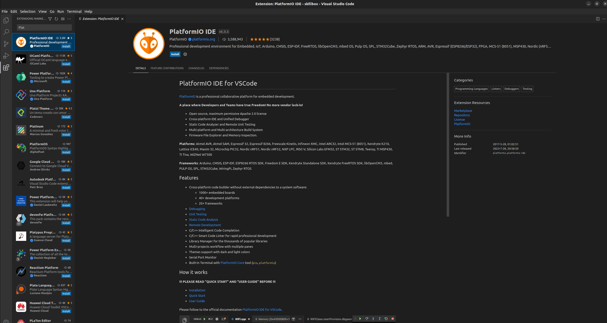

## Markdown

*Markdown* - это облегченный язык разметки текста, который позволяет создавать удобные и красивые файлы документации к вашим проектам.
Для поддержки файлов `*.md` в **VS Code** рекомендуется установить также расширение **Markdown Prview Enhanced**.

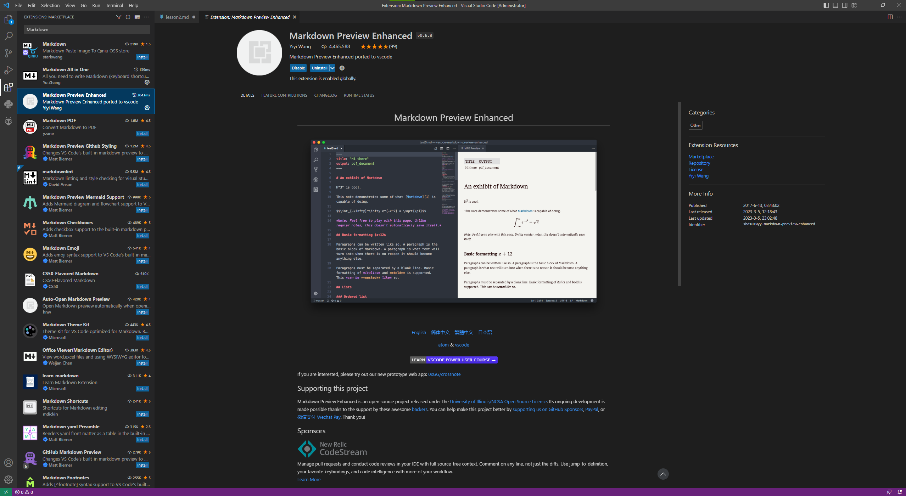

# Установка компилятора в систему

## Windows

Одним из мощнейших компиляторов для Windows является **MSVC** от компании Майкрософт. Для установки этого компилятора в систему можно использовать два пути:
 1. Установить Microsoft Visual Studio с [официального сайта](https://visualstudio.microsoft.com/ru/vs/community/). После запуска установщика необходимо поставить галочку напротив пункта *Разработка классических приложений на C++* и следовать инструкциям установщика
 
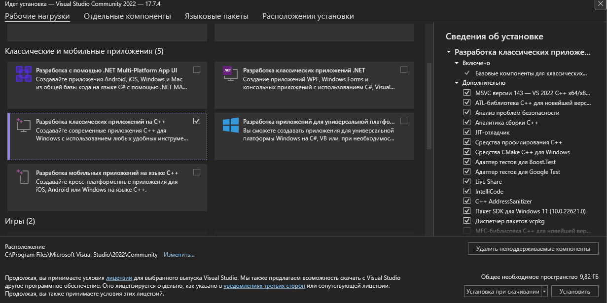

 2. Установить только компилятор, без среды Visual Studio. Для этого:
    - перейти на [страницу](https://visualstudio.microsoft.com/downloads/#remote-tools-for-visual-studio-2022) и скачать **Build Tools for Visual Studio 2022** (2022 - самая актуальная на данный момент версия)

    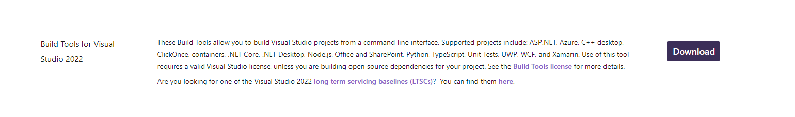

    - запустить скачанный файл, в окне выбора компонентов поставить галочку напротив пункта *Desktop development with C++* и далее следовать инструкциям установщика

    

    - чтобы убедиться, что компилятор успешно установился, зайдите в командную строку разработчика и наберите cl

    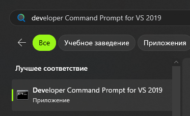 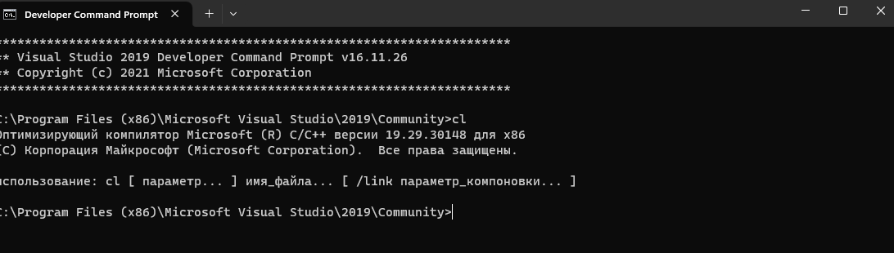
    В командной строке должна отобразиться версия установленного у вас компилятора.

## Ubuntu

Для компиляции программ под Linux можно установить другой распространенный компилятор - **GCC**.
Для этого в терминале необходимо выполнить следующий набор команд:

- обновить установленные пакеты командой
```bash
$ sudo apt update
```

- установить `build-essential` командой
```bash
$ sudo apt install build-essential
```

- убедиться, что **GCC** корректно установлен в системе
```bash
$ gcc --version
```